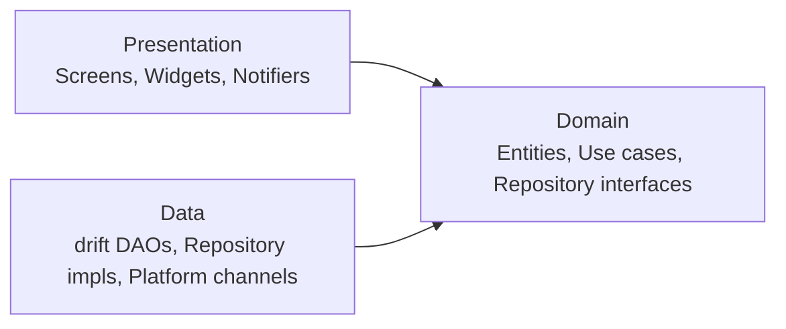
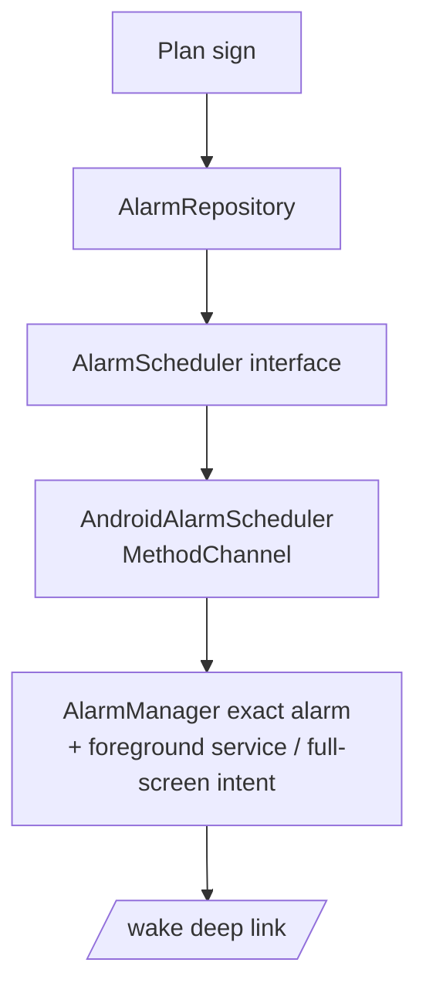

# 3AM Club App — Architecture (v0.2, Personal MVP)

Flutter client, **local-only** (no backend). Companion to the [PRD](./3am-club-prd.md), [Design System](./3am-club-design-system.md) and [Project Brief](./3am-club-app-brief.md).

> Decisions marked **(decision)** are proposals to confirm before implementation.

---

## 1. What changed from v0.1

| Area | v0.1 (vision) | v0.2 (MVP) |
|---|---|---|
| Backend | Firebase / custom API | **None.** Everything on-device. |
| Auth | Accounts | **None.** |
| HTTP (Dio) | Core dependency | **Not in MVP.** Added when a backend exists. |
| Push (FCM) | Partner escalation | **None.** Local notifications only. |
| Data | Cloud + local cache | **drift (SQLite) is the source of truth.** |
| Escalation | Server-side job | **On hold** with pods. |
| Router | Auth/onboarding redirects | Redirects driven by **plan state and time of day**. |

Clean architecture and repository interfaces stay, so a remote data source can be added later without touching domain or UI.

---

## 2. Architectural Drivers

| Driver | Implication |
|---|---|
| Alarm must fire at 03:00–05:00 | Native scheduling behind an interface; Dart never owns the alarm. |
| Half-asleep UX | No network, no spinners on the wake path; simple gestures only. |
| App must open on the right page | A single **DayPhase** state machine decides the route from the clock and DB state. |
| Locked timer must never lose time | Timers derive from stored timestamps, not in-memory counters. |
| Local-only data | Backup/export, UUID ids and `updatedAt` on every row (keeps future sync possible). |

---

## 3. Tech Stack

| Concern | Choice |
|---|---|
| Framework | Flutter (stable). **Android first**; iOS later **(decision)** |
| State | `flutter_riverpod` + `riverpod_annotation` / `riverpod_generator` |
| Routing | `go_router` (`StatefulShellRoute` not needed in MVP; simple top-level routes) |
| Models | `freezed` + `json_serializable` (export/import) |
| Local DB | `drift` + `sqlite3_flutter_libs` |
| Preferences | `shared_preferences` (small flags only) |
| Alarm | Native platform channel; evaluate the `alarm` package as a starting point **(decision)** |
| Notifications | `flutter_local_notifications` (bedtime reminder, timer-complete) |
| Time zones | `timezone` + `flutter_timezone` |
| Wake lock | `wakelock_plus` (keep screen on during promise timer, optional) |
| Haptics / audio | `HapticFeedback` (built in), `audioplayers` or `just_audio` for chimes |
| Animation | `CustomPainter` + `AnimationController` for waves; `flutter_animate` optional; Rive/Lottie optional for the sunrise |
| Export / share | `file_picker`, `share_plus`, `path_provider` |
| i18n | `flutter_localizations` + ARB (`id`, `en`) |
| Lint / test | `flutter_lints` or `very_good_analysis`, `riverpod_lint`, `mocktail`, `flutter_test`, `integration_test` |

---

## 4. Layers (feature-first Clean Architecture)



- **Presentation:** widgets and Riverpod notifiers. No drift or platform-channel imports.
- **Domain:** pure Dart. Entities, repository interfaces, use cases with real rules (time budget, streak, morning result, DayPhase).
- **Data:** drift tables/DAOs, repository implementations, `AlarmScheduler` and `NotificationService` implementations.

Use cases exist where there are rules; simple reads can call repositories from notifiers.

---

## 5. Project Structure

```
lib/
├── main.dart
├── app/
│   ├── app.dart
│   ├── router/
│   │   ├── app_router.dart        # GoRouter provider
│   │   ├── routes.dart            # path constants
│   │   └── redirect.dart          # DayPhase / lock redirects
│   └── theme/                     # tokens from the Design System
├── core/
│   ├── db/                        # drift database, tables, migrations
│   ├── platform/                  # alarm channel, permissions
│   ├── clock/                     # Clock provider (fakeable)
│   ├── time/                      # time budget, minute-of-day helpers
│   ├── error/
│   ├── l10n/
│   └── widgets/                   # HoldButton, WaveBackground, TimerWave, SunriseIcon...
└── features/
    ├── plan/          # bedtime, wake time, pre-sleep checklist, sign
    ├── promises/      # promises + categories + builder
    ├── night/         # night reminder page
    ├── wake/          # alarm integration + wake page
    ├── focus/         # focus page + promise timer
    ├── dashboard/     # streak, journey, milestones, stats
    ├── backup/        # export / import
    └── settings/
       (each feature: data/ domain/ presentation/)
```

---

## 6. Local Data Model (drift)

All tables: `id` (UUID text), `createdAt`, `updatedAt`. Times of day stored as **minutes from midnight**; instants stored as UTC epoch ms plus the local date string where needed.

| Table | Key fields |
|---|---|
| `plans` | `wakeMinute`, `bedMinute`, `whyText?`, `signedAt`, `journeyStartDate`, `journeyLengthDays` (66), `isActive` |
| `pre_sleep_items` | `planId`, `title`, `sortOrder` |
| `categories` | `name`, `iconKey`, `colorKey`, `isBuiltIn`, `isArchived` |
| `promises` | `planId`, `categoryId`, `title`, `description?`, `durationMin`, `sortOrder` |
| `mornings` | `date` (wake date, unique), `planId`, `scheduledAt`, `alarmFiredAt?`, `wakeConfirmedAt?`, `result` (pending / kept / full / missed / rest) |
| `promise_logs` | `morningId`, `promiseId`, `status` (pending / inProgress / kept / notFinished), `startedAt?`, `completedAt?`, `plannedSec`, `endedEarly` |
| `pre_sleep_logs` | `morningId`, `itemId`, `checked`, `checkedAt?` |
| `settings` | bedtime lead minutes, sound, ramp seconds, language, reduce-motion override, etc. |

Notes:
- **Morning date** = the date of the wake time. Evening ticks are stored against the next morning.
- Promises are copied into each morning's `promise_logs` at creation, so editing the plan never rewrites history.
- Current streak and best streak are **derived** from `mornings` (no separate counter to corrupt); cached in a provider.

---

## 7. DayPhase (drives routing)

A pure domain function, unit-tested with a fake clock:

```dart
enum DayPhase { noPlan, day, windDown, ringing, focus, done }

DayPhase resolve({
  required DateTime now,
  required Plan? plan,
  required Morning? todayMorning,   // morning whose wake date is today, or tomorrow when evening
  required bool hasActivePromiseSession,
  required Settings settings,
});
```

| Phase | Rule (summary) | Route |
|---|---|---|
| `noPlan` | no active signed plan | `/plan` |
| `windDown` | now ≥ bedtime − lead, and before the alarm | `/night` |
| `ringing` | alarm fired and wake not confirmed (until 06:00) | `/wake` |
| `focus` | wake confirmed, before 06:00, promises left | `/focus` (or `/focus/promise/:id` if a session is active) |
| `done` | all promises kept, or 06:00 passed | `/dashboard` |
| `day` | otherwise | `/dashboard` |

`dayPhaseProvider` re-evaluates on: app resume, alarm event, a timer scheduled at each boundary (bedtime lead, wake time, 06:00), and DB changes.

---

## 8. Routing (go_router)

```
/plan                     # sleep plan
/plan/promises            # promise builder
/plan/sign                # review + hold to sign
/night                    # night reminder
/wake                     # alarm wake page (full screen)
/focus                    # promise list
/focus/promise/:id        # locked countdown timer
/dashboard
/settings
/settings/backup
```

- One `GoRouter` provider that `ref.watch`es `dayPhaseProvider` and `activePromiseSessionProvider` and uses them as `refreshListenable`.
- `redirect` rules, in order:
  1. Active promise session exists → force `/focus/promise/:id`.
  2. `noPlan` → `/plan` (planning routes allowed).
  3. `ringing` → `/wake`.
  4. Other phases: initial location by phase, but the user may freely navigate to `/dashboard` (small link on `/night`) and `/settings`.
- **Deep links** from notifications and the alarm full-screen intent: `/wake`, `/night`, `/focus`.
- **Locked timer:** the route is wrapped in `PopScope(canPop: false)`, and the redirect rule above makes any navigation away resolve back to the timer while a session is active. The only exit is **Complete** (after countdown) or the safety exit.

---

## 9. State (Riverpod)

- Code-gen `@riverpod` providers only. `AsyncNotifier` for DB-backed state; `Notifier` for UI state; DB queries exposed as **Streams** (`drift` `watch()`), so the UI updates live.
- Repositories are `keepAlive` providers, overridden with fakes in tests.
- Side effects (navigation, haptics) triggered from widgets with `ref.listen`.

| Provider | Purpose |
|---|---|
| `clockProvider` | Injectable `DateTime.now()` source |
| `planProvider` | Active plan + promises + pre-sleep items |
| `planDraftProvider` | In-progress builder state (`Notifier`, not persisted until signed) |
| `timeBudgetProvider` | Derived: wake time → 06:00 vs promise total |
| `dayPhaseProvider` | Section 7 |
| `todayMorningProvider` | Current morning + promise logs (stream) |
| `wakeControllerProvider` | Alarm events, hold confirmation |
| `promiseSessionProvider` | Active timer: start, remaining, complete, end early |
| `streakProvider` | Current/best streak, milestones, journey phase |
| `dashboardStatsProvider` | Minutes focused, earliest wake, per-promise rates |

---

## 10. Alarm Subsystem (highest risk)



```dart
abstract interface class AlarmScheduler {
  Future<void> schedule(AlarmSpec spec);      // next occurrence of wake time
  Future<void> cancel(String alarmId);
  Future<AlarmPermissionStatus> checkPermissions();
  Stream<AlarmEvent> get events;              // fired, stopped
  Future<void> stopRinging();                 // called after 5s hold completes
}
```

**Android**
- Exact alarm permission and notification permission handled in onboarding; battery-optimization exemption guidance (OEM-specific) in a settings help page.
- Full-screen intent shows `/wake` over the lock screen.
- Gradual volume ramp handled natively.
- Re-register on **boot, time change, timezone change, and app update** (broadcast receivers).
- Only **one** alarm needs to exist at a time: schedule the next morning's, and reschedule when a morning finishes.
- App-open **health check**: verify the next alarm is registered; re-register and warn if permissions were revoked.

**iOS (later, decision):** AlarmKit where available, time-sensitive notification fallback; needs its own spike and App Review checks.

**Re-ring policy (decision):** proposal is ring 10 min, then re-fire every 5 min, up to 3 times.

**Spike M0 must prove:** fires on time when locked, in DND, in battery saver, after reboot, after app force-stop by the user (document expected behavior), and across at least 3 OEM skins.

---

## 11. Promise Timer (locked, persistent)

- On **Start**: insert/update `promise_logs` row with `status = inProgress`, `startedAt = now`, `plannedSec`.
- Remaining = `plannedSec − (now − startedAt)`, recomputed on every tick and on resume. Ticks only drive the UI.
- Schedule a local notification at `startedAt + plannedSec` so completion is signaled even with the screen off.
- `activePromiseSessionProvider` is derived from the DB (`inProgress` row exists), which is what makes the router lock survive process death.
- **Complete** is enabled only when `remaining <= 0`; on tap, set `kept` + `completedAt`.
- **Safety exit:** long-press + confirm sets `notFinished`, `endedEarly = true`.
- Optional `wakelock_plus` while the timer page is visible (setting).
- Use monotonic-safe handling: if the wall clock is changed mid-timer, prefer the larger of elapsed values and never allow negative remaining (edge case documented in tests).

---

## 12. Morning Result & Streak (domain use cases)

- `CloseMorning` runs at 06:00 (scheduled) and on app open if a stale morning exists: marks pending promises `notFinished`, computes `result`:
  - `full` = wake confirmed and all promises `kept`
  - `kept` = wake confirmed and at least 1 promise `kept`
  - `missed` = otherwise; `rest` if a rest day was used (P1)
- `ComputeStreak` reads ordered `mornings`, counts consecutive `kept/full`, treats `rest` as neutral, returns current/best, next milestone, journey phase.
- All rules are pure Dart with a fake clock, so they are fully unit-testable.

---

## 13. Notifications

| Notification | Trigger | Opens |
|---|---|---|
| Bedtime reminder | bedtime − lead (default 30 min) | `/night` |
| Timer complete | promise `startedAt + plannedSec` | `/focus/promise/:id` |
| Wake alarm | native alarm (not a notification) | `/wake` |

Channels: separate importance levels; the alarm is **not** a normal notification.

---

## 14. Backup (local-only mitigation)

- Export: serialize all tables (via freezed/json) into one versioned JSON file, share via the system sheet.
- Import: validate schema version, preview counts, replace or merge (start with **replace**), then re-schedule alarms.
- Schema versioning from day one (`exportVersion`), and drift migrations tested.

---

## 15. Cross-Cutting

- **Theming:** design tokens as `ThemeExtension`s; dark default.
- **Animations:** waves are `CustomPainter` driven by a single `AnimationController` (30fps cap on night/timer pages), paused on inactivity and when `MediaQuery.disableAnimations` is true.
- **HoldButton:** `GestureDetector`/`Listener` with a controller driving the ring; completion callback after full duration; semantic long-press action and accessible confirm alternative.
- **Errors:** typed `Failure`s, friendly messages per Design System tone.
- **Logging:** no personal content in logs; debug-only.
- **Flavors:** `dev`, `prod`.
- **Localization:** ARB from day one (`id`, `en`); no hardcoded strings.

---

## 16. Testing

| Level | Focus |
|---|---|
| Unit | `DayPhase.resolve`, time budget, streak, morning result, milestone/journey logic (fake clock) |
| DB | drift migrations, morning/promise log queries, export/import round trip |
| Widget | HoldButton (2.9s vs 3s), TimeBudgetBar states, Promise timer button states, Focus list, Dashboard empty state |
| Integration | Plan → sign → simulated alarm → hold → focus → timer → dashboard |
| Device lab | Alarm reliability matrix; kill app mid-timer; reboot; time-zone change |

---

## 17. Build Order

1. **M0:** Android native alarm spike on real devices.
2. **M1:** app shell, theme, drift schema, plan + promise builder + sign, local notifications.
3. **M2:** DayPhase + router redirects, night page, wake page + alarm integration, focus page.
4. **M3:** promise timer (locked, persistent), morning close and results.
5. **M4:** dashboard, streak/milestones/celebrations, rest day (P1), backup (P1).
6. **M5:** hardening (OEM guidance, a11y, i18n review), pilot build.

---

## 18. Post-MVP: When Members Come Back

Add without rewriting the core:
- New `remote` data sources behind existing repository interfaces (add Dio or Firebase then).
- Sync using existing UUIDs and `updatedAt` (last-write-wins per row, server owns pod/escalation state).
- Server-side escalation (deadline job, push to partner) as designed in v0.1: the phone cannot report its own failure to wake.
- Pods, on-call rotation, partner privacy rules (partner sees wake status only).

---

## 19. Open Decisions

1. Android-only pilot vs. iOS from the start.
2. `alarm` package vs. fully custom native channels.
3. Alarm re-ring policy and late-wake rule (see PRD).
4. Minimum Android API level.
5. Whether promises can vary by weekday after MVP.
6. Backup: replace-only vs. merge.